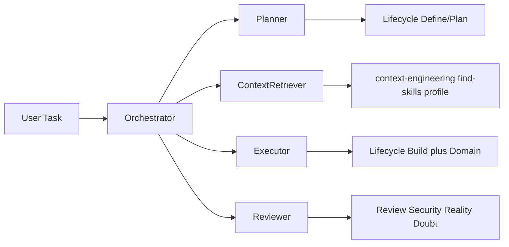

# Skills Architecture

Unified agent skill architecture for Cursor, Claude Code, and OpenCode. Git source of truth is `agent-skills/skills/`; tool dirs are symlink farms.

---

## Layers

```text
Layer 0  Meta          using-agent-skills, find-skills, vercel-web-skills,
                       ali-engineering-workflow, context-engineering
Layer 1  Lifecycle     Define → Plan → Build → Verify → Review → Ship
Layer 2  Domain        Azure/Foundry/Entra, career, brand (all in repo),
                       FE vercel packages (external via find-skills)
Layer 3  Personas      Thin role lenses over Layers 1–2
Layer 4  Archive       skills/_archive/ — discoverable, not auto-routed
```

### Layer responsibilities

| Layer | Single Responsibility | Depends on |
|-------|----------------------|------------|
| Meta | Route and discover | Nothing (entry) |
| Lifecycle | One engineering phase | `references/` |
| Domain | Stack- or person-specific contracts | Lifecycle + profile |
| Personas | Role lens / checklist tone | Lifecycle or Domain |
| Archive | Deferred specialists | Explicit user request |

---

## SOLID applied to skills

- **S** — One skill = one phase or one domain contract.
- **O** — Extend via `references/` and modes, not near-duplicate sibling skills.
- **L** — A persona may substitute a workflow *section* without breaking the lifecycle contract.
- **I** — Agents load only the skill for the current phase (router enforces).
- **D** — Skills depend on `references/` + profile facts, not on each other’s full bodies.

---

## Exposure model

| Exposure | When | Examples |
|----------|------|----------|
| **Context prompt** | Always-on routing / profile | `using-agent-skills`, `ali-career-profile` |
| **Workflow skill** | Phase-bound process | `spec-driven-development`, `code-review-and-quality` |
| **Persona skill** | Role lens over a workflow | `security-architect`, `software-architect` |
| **Tool / CLI** | External capability | `npx skills find`, resume DOCX renderer |
| **Slash command** | Human UX entry to Layer 1 | `/spec`, `/plan`, `/build`, `/review`, `/ship` |

Slash commands bind to Layer-1 skills only. Personas and Domain skills are invoked by name or via the meta router.

---

## Source of truth

**One tree:** `agent-skills/skills/<name>/`. Every tool is a symlink farm pointing at it.

| Skill class | Canonical home | Consumers |
|-------------|----------------|-----------|
| Lifecycle, career, personas, Azure/Foundry/Entra, brand, extras | `agent-skills/skills/` | Cursor (`~/.cursor/skills`), Claude (`~/.claude/skills`), OpenCode (`~/.agents/skills` + `~/.claude/skills`) |
| Archived | `agent-skills/skills/_archive/` | Not auto-linked. Invoke only from git. |
| Cursor platform | `~/.cursor/skills-cursor/` | Cursor IDE (managed by Cursor; not in this repo) |

`install.sh` (and `scripts/bootstrap.ps1`) recreates all three symlink farms. Do not keep a second real copy under `~/.agents` or `~/.claude`. OpenCode has no `~/.config/opencode/skills` on purpose — it already reads Claude + agents.

---

## ADG agent workflow



1. **Orchestrator** picks phase and skill via `using-agent-skills` (or `ali-engineering-workflow` for Ali’s stack).
2. **Planner** clarifies and specs before code.
3. **Context Retriever** loads profile, official docs, or ecosystem skills.
4. **Executor** implements in small increments with tests.
5. **Reviewer** runs quality / security / reality checks before ship.

---

## Install contract

- `install.sh` and `scripts/bootstrap.ps1` symlink each `skills/<name>/` **except** `_archive` into `~/.cursor/skills`, `~/.claude/skills`, and `~/.agents/skills`.
- `skills/_archive/` stays in git for recovery; not linked into any tool dir.
- Shared checklists live in repo `references/` and are symlinked as `~/.cursor/skills/references` only.

---

## Career path (canonical)

```text
ali-career-profile → freelance-hunt → cv-jd-matcher
                   → build-tailored-resume (.docx)
                   → linkedin-optimizer
                   → rs-interview-prep-generator
```

## Content path (brand)

```text
personal-brand → content-matrix          (ideas, optional)
               → social-content-system   (copy)
               → social-visuals          (HTML / Gemini, optional)
               → analytics-review        (after posting)
```

Profile work stays on the career path. Do not route "write a post" to `linkedin-optimizer`.

---

## Related docs

- [../skills/README.md](../skills/README.md) — One-line catalog of every active skill
- [SKILLS_MATRIX.md](SKILLS_MATRIX.md) — Keep / Merge / Drop tables
- [../SYNC.md](../SYNC.md) — Multi-machine sync
- [../ATTRIBUTION.md](../ATTRIBUTION.md) — Upstream sources
